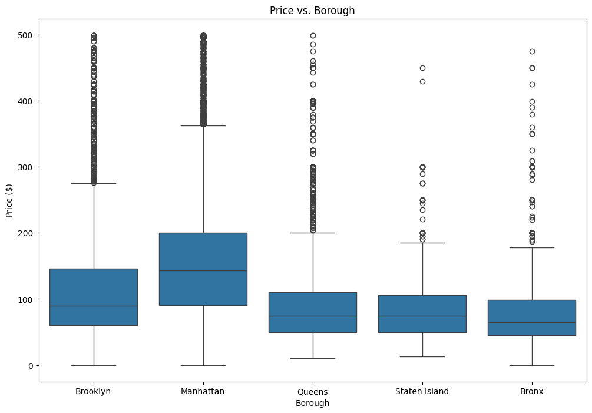
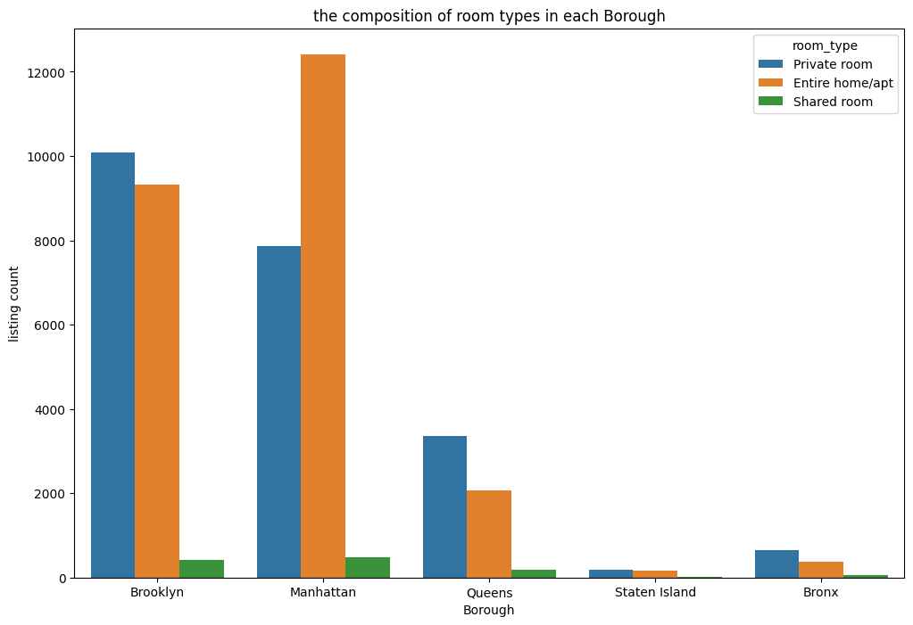
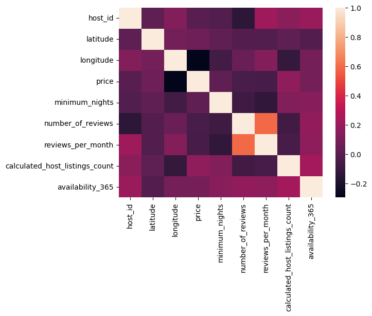

# 🗽 NYC Airbnb Market Analysis (2019)

### 📊 Project Overview
This project performs a comprehensive **Exploratory Data Analysis (EDA)** on the New York City Airbnb market. Using a dataset of nearly 50,000 listings, we investigate how location, room type, and availability influence rental prices across the five boroughs.

The goal is to identify profitable trends and understand the market structure for potential investors or hosts.

---

### 🔍 Key Findings
Based on the analysis of the 2019 dataset:

1.  **Manhattan is the Premium Market:** It has the highest median price (~$150/night) and the widest price range.
2.  **The "Longitude Effect":** There is a confirmed negative correlation between longitude and price; as you move East (away from Manhattan center), prices drop significantly.
3.  **Market Segmentation:** Manhattan is dominated by "Entire Home/Apt" listings, while Brooklyn leads in "Private Room" inventory, catering to budget-conscious travelers.
4.  **Review Behavior:** Listings with high minimum night requirements tend to have significantly fewer reviews per month.

---

### 📈 Visual Insights

#### 1. Price Distribution by Borough
*We analyzed the price spread across the 5 boroughs to identify luxury vs. budget areas.*

*(Note: Outliers above $500 were filtered for clarity)*

#### 2. Market Supply: Room Type Preference
*Breakdown of inventory shows distinct preferences in Manhattan vs. Brooklyn.*


#### 3. Correlation Heatmap
*Analyzing the relationship between price, location, and reviews.*


---

### 🛠️ Technologies & Tools

* **Python 3.10**
* **Pandas:** Data cleaning (handling nulls, type conversion), aggregation, and filtering.
* **Seaborn & Matplotlib:** Statistical data visualization (Boxplots, Histograms, Heatmaps).
* **NumPy:** Numerical operations.
* **Jupyter Notebook:** Interactive development environment.

---

### ⚙️ The Process (Methodology)

1.  **Data Cleaning:**
    * Identified and handled missing values in `reviews_per_month`.
    * Removed irrelevant columns (`id`, `host_name`) to optimize performance.
    * Filtered extreme outliers (listings > $500/night) to focus on the standard market.
2.  **Feature Engineering:**
    * Analyzed the relationship between geographical coordinates (Latitude/Longitude) and Price.
3.  **Exploratory Analysis:**
    * Univariate analysis of Price distribution.
    * Multivariate analysis using GroupBy to compare Boroughs and Room Types.

---

### 💻 How to Run This Project

1.  Clone the repository:
    ```bash
    git clone https://github.com/shank187/nyc-airbnb-analysis
    ```
2.  Install the required packages:
    ```bash
    pip install pandas matplotlib seaborn numpy
    ```
3.  Open the notebook:
    ```bash
    jupyter notebook nyc_airbnb_analysis.ipynb
    ```

---
*Author: [Aymane El Bour] | [https://www.linkedin.com/in/aymane-elbour-19315a253/]*